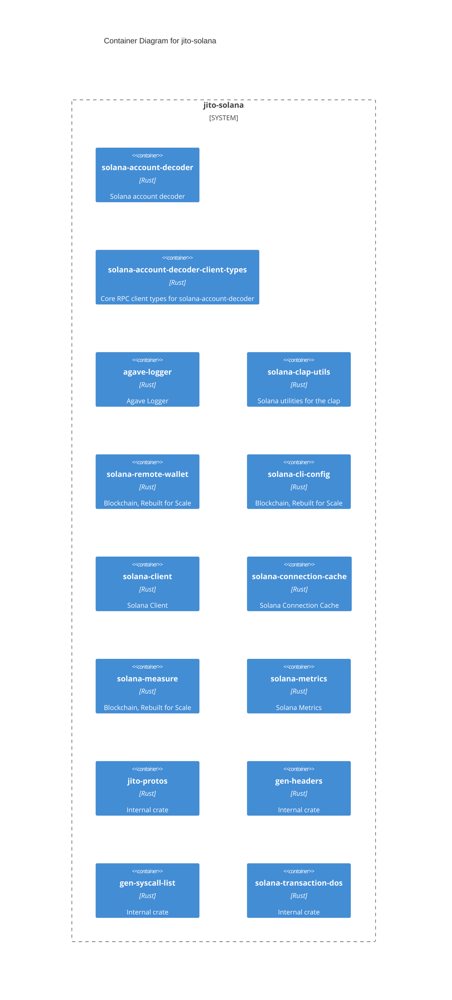
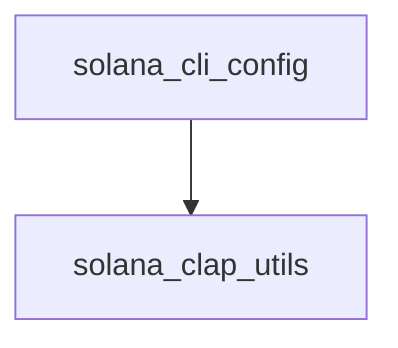

# High-Level Design: jito-solana

## Architecture Style Assessment

| Style | Confidence | Description |
|-------|------------|-------------|
| Multi-Crate Workspace | 90% | Multiple crates in a workspace, each with specific responsibility |
| Hexagonal/Ports-Adapters | 83% | Domain logic separated from infrastructure through traits (pluggable storage) |
| Reactor/Proactor | 83% | Async I/O with event loop (Tokio, async-std style) |
| Work-Stealing Scheduler | 75% | Load-balanced task scheduling across worker threads |
| Event-Driven | 60% | Components communicate through events and messages |
| Plugin Architecture | 50% | Core system with extensible plugin-based functionality |
| Actor Model | 40% | Concurrent computation using actors with message mailboxes |
| ECS (Entity-Component-System) | 33% | Data-oriented design with entities, components, and systems |

## Container Diagram

## Core Components

| Component | Type | Dependencies | Features |
|-----------|------|--------------|----------|
| `solana-account-decoder` | Library | 39 | 1 |
| `solana-account-decoder-client-types` | Library | 7 | 2 |
| `agave-logger` | Library | 4 | 1 |
| `solana-clap-utils` | Library | 26 | 1 |
| `solana-remote-wallet` | Library | 18 | 7 |
| `solana-cli-config` | Library | 7 | 1 |
| `solana-client` | Library | 41 | 2 |
| `solana-connection-cache` | Library | 19 | 2 |
| `solana-measure` | Library | 0 | 1 |
| `solana-metrics` | Library | 14 | 1 |
| `solana-net-utils` | Library | 20 | 3 |
| `solana-svm-type-overrides` | Library | 3 | 3 |
| `solana-pubsub-client` | Library | 21 | 1 |
| `solana-rpc-client-types` | Library | 21 | 1 |
| `solana-transaction-status-client-types` | Library | 17 | 1 |

*15 test/bench/example crates not shown*

## Internal Dependencies

## Communication Patterns

| Pattern | Usage Count | Evidence |
|---------|-------------|----------|
| Shared State (RwLock) | 1081 | `Arc<RwLock, RwLock<` |
| Shared State (Mutex) | 306 | `Arc<Mutex, Mutex<` |
| Channel-based (tokio) | 49 | `tokio::sync::mpsc, tokio::sync::oneshot` |
| Channel-based (crossbeam) | 3 | `crossbeam-channel` |
| Message Passing | 2 | `ractor` |

## Design Patterns

### Type-State (100%)

**Evidence:**
- pattern: struct\s+\w+<\w+>...
- pattern: impl\s+\w+<\w+>...
- pattern: fn\s+\w+\(self\)\s*->\s*\w+<\w...

### Error Handling (thiserror) (100%)

**Evidence:**
- import: thiserror
- pattern: #\[derive\([^)]*Error[^)]*\)\]...

### Error Handling (anyhow) (100%)

**Evidence:**
- keyword: .context(
- keyword: anyhow!
- keyword: bail!

### Builder (86%)

**Evidence:**
- keyword: Builder
- keyword: build()
- keyword: with_

### Async/Await Runtime (50%)

**Evidence:**
- keyword: #[tokio::main]
- keyword: async fn
- keyword: .await

### CRDT (30%)

**Evidence:**
- keyword: CRDT
- keyword: Replica
- keyword: Merge

### Tower Service (20%)

**Evidence:**
- import: tower

## Runtime Observability

- **Uses `tracing`:** ✅
- **Tokio tracing:** ✅
- **Instrumented functions:** 0
