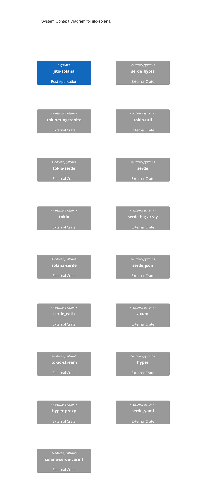

# System Context: jito-solana

## Overview

A Rust project

## Context Diagram

## External Dependencies

| Crate | Purpose |
|-------|---------|
| `Inflector` | Third-party library |
| `aes-gcm-siv` | Third-party library |
| `affinity` | Third-party library |
| `ahash` | Third-party library |
| `anyhow` | Error handling for applications |
| `aquamarine` | Third-party library |
| `arbitrary` | Third-party library |
| `arc-swap` | Third-party library |
| `ark-bn254` | Third-party library |
| `arrayref` | Third-party library |
| `arrayvec` | Third-party library |
| `assert_cmd` | Third-party library |
| `assert_matches` | Third-party library |
| `async-lock` | Third-party library |
| `async-trait` | Async methods in traits |

## Key Capabilities

- **Multi-Crate Workspace** (90%): Multiple crates in a workspace, each with specific responsibility
- **Hexagonal/Ports-Adapters** (83%): Domain logic separated from infrastructure through traits (pluggable storage)
- **Reactor/Proactor** (83%): Async I/O with event loop (Tokio, async-std style)

### Detected Design Patterns

- **Type-State** (100%)
- **Error Handling (thiserror)** (100%)
- **Error Handling (anyhow)** (100%)
- **Builder** (86%)
- **Async/Await Runtime** (50%)