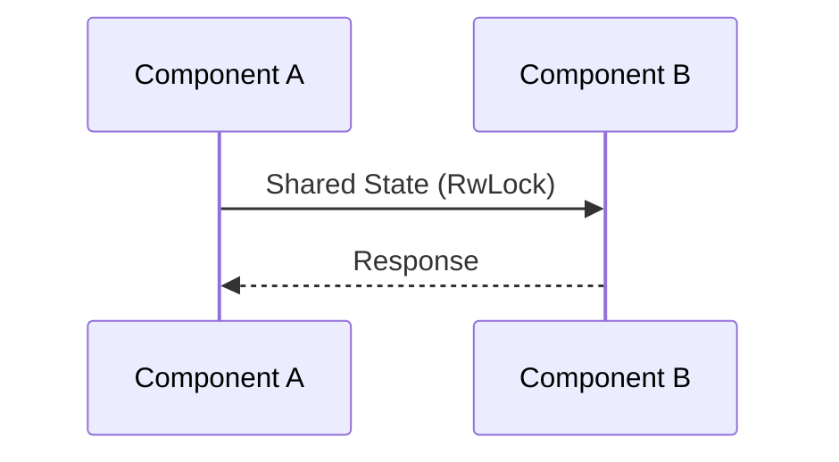
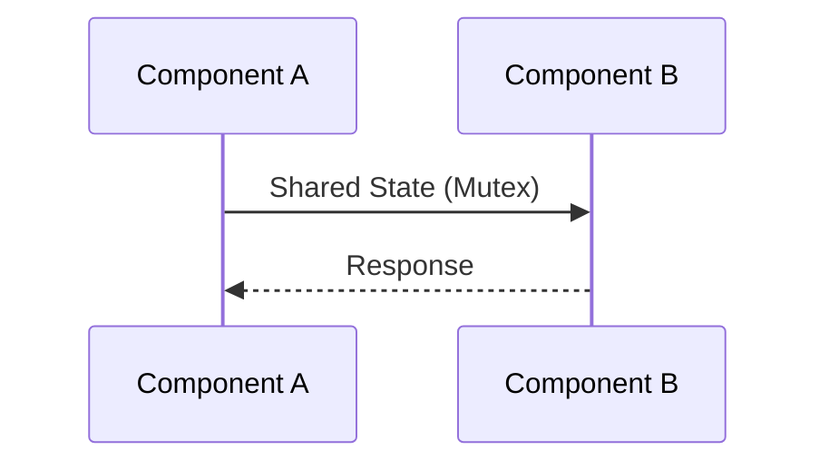
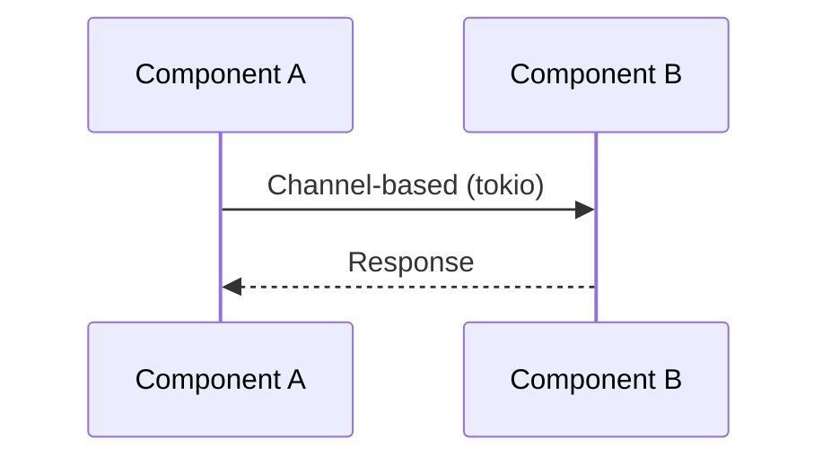

# Data Flow: jito-solana

## Communication Patterns

### Shared State (RwLock)

```mermaid
sequenceDiagram
    participant A as Component A
    participant B as Component B
    A->>B: Shared State (RwLock)
    B-->>A: Response
```

### Shared State (Mutex)

```mermaid
sequenceDiagram
    participant A as Component A
    participant B as Component B
    A->>B: Shared State (Mutex)
    B-->>A: Response
```

### Channel-based (tokio)

```mermaid
sequenceDiagram
    participant A as Component A
    participant B as Component B
    A->>B: Channel-based (tokio)
    B-->>A: Response
```
