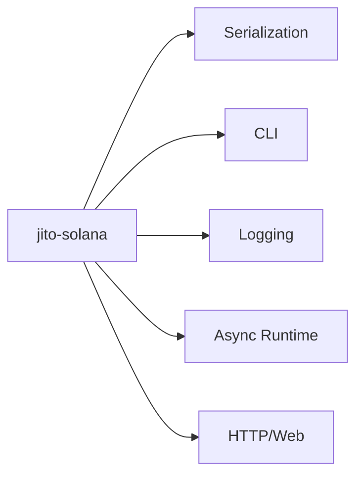

# Integration Points: jito-solana

## External Systems

| Category | Dependencies |
|----------|--------------|
| Serialization | `serde`, `serde_json`, `serde_yaml`, `toml` |
| CLI | `clap` |
| Logging | `log`, `env_logger`, `tracing` |
| Async Runtime | `tokio` |
| HTTP/Web | `reqwest`, `hyper`, `axum`, `tower` |
| Testing | `criterion`, `proptest`, `mockall` |

## Integration Architecture

