# Internal Contracts: jito-solana

## Module Structure

```mermaid
graph TD
    ledger[ledger]
    ledger_error[ledger_error]
    locator[locator]
    remote_keypair[remote_keypair]
    remote_wallet[remote_wallet]
    compute_budget[compute_budget]
    compute_unit_price[compute_unit_price]
    fee_payer[fee_payer]
    input_parsers[input_parsers]
    input_validators[input_validators]
    keypair[keypair]
    memo[memo]
    nonce[nonce]
    offline[offline]
    error[error]
```

## Module Exports

| Module | Source File |
|--------|-------------|
| `ledger` | remote-wallet/src/lib.rs |
| `ledger_error` | remote-wallet/src/lib.rs |
| `locator` | remote-wallet/src/lib.rs |
| `remote_keypair` | remote-wallet/src/lib.rs |
| `remote_wallet` | remote-wallet/src/lib.rs |
| `compute_budget` | clap-utils/src/lib.rs |
| `compute_unit_price` | clap-utils/src/lib.rs |
| `fee_payer` | clap-utils/src/lib.rs |
| `input_parsers` | clap-utils/src/lib.rs |
| `input_validators` | clap-utils/src/lib.rs |
| `keypair` | clap-utils/src/lib.rs |
| `memo` | clap-utils/src/lib.rs |
| `nonce` | clap-utils/src/lib.rs |
| `offline` | clap-utils/src/lib.rs |
| `error` | scheduling-utils/src/lib.rs |
| `thread_aware_account_locks` | scheduling-utils/src/lib.rs |
| `handshake` | scheduling-utils/src/lib.rs |
| `pubkeys_ptr` | scheduling-utils/src/lib.rs |
| `responses_region` | scheduling-utils/src/lib.rs |
| `transaction_ptr` | scheduling-utils/src/lib.rs |

## Crate Boundaries

| Crate | Public Items | Dependencies |
|-------|--------------|--------------|
| `solana-account-decoder` | - | 39 |
| `solana-account-decoder-client-types` | - | 7 |
| `solana-accounts-cluster-bench` | - | 39 |
| `agave-logger` | - | 4 |
| `solana-clap-utils` | - | 26 |
| `solana-remote-wallet` | - | 18 |
| `solana-cli-config` | - | 7 |
| `solana-client` | - | 41 |
| `solana-connection-cache` | - | 19 |
| `solana-measure` | - | 0 |
| `solana-metrics` | - | 14 |
| `solana-net-utils` | - | 20 |
| `solana-svm-type-overrides` | - | 3 |
| `solana-pubsub-client` | - | 21 |
| `solana-rpc-client-types` | - | 21 |