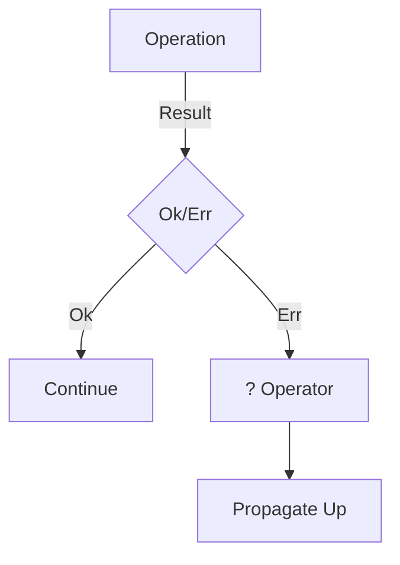

# Error Handling: jito-solana

## Error Strategy Summary

| Metric | Value |
|--------|-------|
| Uses `anyhow` | ✅ |
| Uses `thiserror` | ✅ |
| Result returns | 2664 |
| `?` operator usage | 5960 |
| `.unwrap()` calls | 16209 |
| `.expect()` calls | 1376 |

## Assessment

⚠️ **Warning**: High usage of `.unwrap()/.expect()` may cause panics

## Error Propagation Pattern

## Custom Error Types

- `runtime/src/stakes.rs`
- `transaction-status/src/lib.rs`
- `gossip/src/restart_crds_values.rs`
- `votor/src/vote_history.rs`
- `core/src/result.rs`