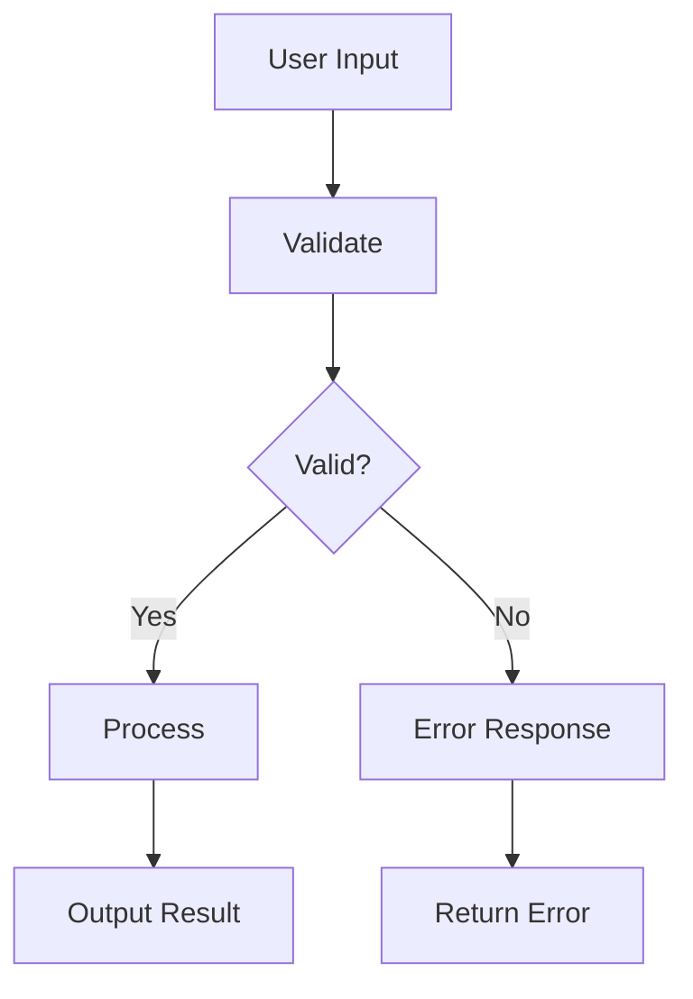

# Main Flows: jito-solana

## Core Use Cases

## Processing Pipeline

| Step | Pattern | Description |
|------|---------|-------------|
| 1 | Shared State (RwLock) | Inter-component communication |
| 2 | Shared State (Mutex) | Inter-component communication |
| 3 | Channel-based (tokio) | Inter-component communication |
| 4 | Channel-based (crossbeam) | Inter-component communication |
| 5 | Message Passing | Inter-component communication |